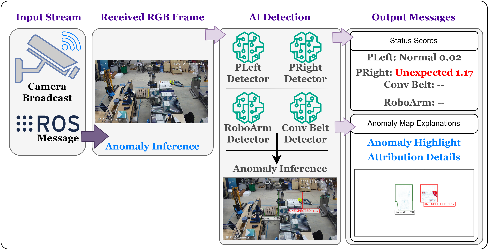

# DistriMuSe-UC3

> **University of Torino**  
> **DistriMuSe Project** — Distributed Multi-Sensor Systems for Human Safety and Health

---



## Use Case 3 — Safe Interaction with Robots

This repository contains a **real-time anomaly detection pipeline** based on **VAE / VAE-GAN models** for monitoring industrial safety areas in collaborative robotics environments.

The pipeline supports:

- Video preprocessing and masking
- Safety-area-specific model training
- Threshold calibration
- Live ROS-based inference
- GUI-based inspection
- Rulex / ROS message publishing

---

## Pipeline Overview

```text
Raw Video / ROS Stream
        ↓
Frame Extraction + Masking
        ↓
Safety Area Cropping / Resize
        ↓
VAE-GAN Training
        ↓
Threshold Calibration
        ↓
Live Inference / Alert Publishing
```

---

## Safety Areas

| ID | Description |
|---|---|
| `RoboArm` | Robot arm zone |
| `ConvBelt` | Conveyor belt zone |
| `PLeft` | Personnel left zone |
| `PRight` | Personnel right zone |
| `ALL` | Run all safety areas |

---

## Smart Robotics ROS Libraries

The following external libraries are used for ROS2 communication:

| Library | Purpose |
|---|---|
| `distrimuse-image-broadcaster` | Broadcast camera/image stream |
| `distrimuse-ros2-api` | Receive ROS detection messages |

Repositories:

- [https://github.com/smart-robotics/**_distrimuse-image-broadcaster_**](https://github.com/smart-robotics/distrimuse-image-broadcaster)
- [https://github.com/smart-robotics/**_distrimuse-ros2-api_**](https://github.com/smart-robotics/distrimuse-ros2-api)

---

## Quick Start

1. Connect to the remote device
2. Install the Pixi environment
3. Replay the recorded ROS bag
4. Run live inference or GUI inference
5. Publish detection results 

---

## 1. Setup Environment

### 1.1 Connect to Remote Device (HP)

```bash
ssh -X unito@distrimuse
```

### 1.2 Install Pixi Environment

```bash
cd ~/advis/advis_distrimuse_unito_SR
pixi install
```

### 1.3 Verify Installation

```bash
pixi run python -c "import rclpy; print('ROS OK')"
pixi run python -c "import cv2; print('CV OK')"
pixi run python -c "import torch; print(torch.cuda.is_available())"
```

<details>
<summary><strong>Optional: ROS2 installation steps</strong></summary>

### ROS2 Installation

```bash
mkdir -p ~/ros2_ws/src
cd ~/ros2_ws/src
git clone https://github.com/smart-robotics/distrimuse-ros2-api.git
cd ~/ros2_ws
sudo apt install colcon
colcon build
```

</details>

---

## 2. Broadcast Image Stream

Use the image broadcaster to replay recorded sensor streams.

<details>
<summary><strong>Expand broadcast commands</strong></summary>

### Configure environment

```bash
cd ~/advis/distrimuse-image-broadcaster

export ROS_LOCALHOST_ONLY=1
export ROS_DOMAIN_ID=0
export RMW_IMPLEMENTATION=rmw_fastrtps_cpp
```

### Verify ROS bag

```bash
pixi run ros2 bag info /home/unito/advis/bags/recording_20260313_133316
```

### Replay bag

```bash
pixi run replay /home/unito/advis/bags/recording_20260313_133316/ \
  --no-display \
  --loop
```

</details>

---

## 3. Save Frames from ROS Broadcast

This step is only needed if you want to save frames again for training or dataset creation.

<details>
<summary><strong>Expand frame-saving workflow</strong></summary>

### 3.1 Verify sensor broadcast

```bash
cd ~/advis/distrimuse-image-broadcaster
pixi run ros2 topic list | grep camera
pixi run ros2 topic hz /camera/back_view/image_raw
```

### 3.2 Save frames

```bash
pixi run python scripts/pixi/pixi_flow.py \
  --ros-args \
  -p save_dir:=/home/unito/advis/DS/SR/v3/train_processed/back_view \
  -p camera_topic:=/camera/back_view/image_raw \
  -p area_names:="['ConvBelt','PLeft','PRight','RoboArm']" \
  -p static_mask_paths:="[
  '/home/unito/advis/DS/SR/v2/masks/Mask Generation_ConvBelt_MASK.png',
  '/home/unito/advis/DS/SR/v2/masks/Mask Generation_PLeft_MASK.png',
  '/home/unito/advis/DS/SR/v2/masks/Mask Generation_PRight_MASK.png',
  '/home/unito/advis/DS/SR/v2/masks/Mask Generation_RoboArm_MASK.png'
  ]" \
  -p save_every_n:=5 \
  -p image_format:=png
```

</details>

---

## 4. Training Models

### 4.1 Flush Existing Models

```bash
pixi run python scripts/flush_data.py \
  --safety_area ALL \
  --latent_dims 64 \
  --dry_run
```

<details>
<summary><strong>Expand training commands</strong></summary>

### 4.2 Train on old dataset (`v2`)

```bash
conda activate dm_unito
cd ~/advis/advis_distrimuse_unito_SR

python scripts/train.py \
  --safety_area ALL \
  --dataset_source SR \
  --dataset_version v2 \
  --dataset_cam_type refined \
  --epochs 200 \
  --batch_size 16 \
  --latent_dims 64 \
  --augmentation_type custom \
  --save_figures
```

### 4.3 Train on new ROS dataset (`v3`)

```bash
python scripts/train.py \
  --safety_area ALL \
  --dataset_source SR \
  --dataset_version v3 \
  --dataset_cam_type back_view \
  --epochs 200 \
  --batch_size 16 \
  --latent_dims 64 \
  --augmentation_type custom
```

</details>

---

## 5. Threshold Calibration

<details>
<summary><strong>Expand threshold calibration commands</strong></summary>

### 5.1 Validation threshold calibration

```bash
conda activate dm_unito
cd ~/advis/advis_distrimuse_unito_SR

python scripts/calibrate_threshold.py \
  --mode val \
  --safety_area ALL \
  --dataset_version v2 \
  --dataset_type refined
```

### 5.2 Test threshold calibration

```bash
python scripts/calibrate_threshold.py \
  --mode test \
  --safety_area ALL \
  --gt_csv scripts/data/annotations.csv
```

</details>

---

## 6. Live ROS Inference

### 6.1 Verify Topics

```bash
pixi run ros2 topic list | grep camera
pixi run ros2 topic hz /camera/back_view/image_raw
```

<details>
<summary><strong>Expand live inference command</strong></summary>

```bash
pixi run python scripts/infer_ros_live.py \
  --camera_topic /camera/back_view/image_raw \
  --safety_area ALL \
  --area_names RoboArm ConvBelt PLeft PRight \
  --static_mask_paths \
    /home/unito/advis/DS/SR/v3/masks/Mask\ Generation_RoboArm_MASK.png \
    /home/unito/advis/DS/SR/v3/masks/Mask\ Generation_ConvBelt_MASK.png \
    /home/unito/advis/DS/SR/v3/masks/Mask\ Generation_PLeft_MASK.png \
    /home/unito/advis/DS/SR/v3/masks/Mask\ Generation_PRight_MASK.png \
  --threshold_dir scripts/results/thresholds \
  --checkpoints scripts/results/models \
  --latent_dims 64 \
  --frame_stride 1
```

</details>

---

## 7. GUI Inference

The GUI mode supports timeline visualization, detailed model inspection, and message publishing.

<details>
<summary><strong>Expand GUI inference commands</strong></summary>

### 7.1 GUI with timeline

Uses `--show_timeline` to visualize the temporal evolution of detections.

```bash
pixi run python scripts/infer_ros_live_GUI_v3.py \
  --camera_topic /camera/back_view/image_raw \
  --safety_area ALL \
  --area_names RoboArm ConvBelt PLeft PRight \
  --static_mask_paths \
    /home/unito/advis/DS/SR/v3/masks/Mask\ Generation_RoboArm_MASK.png \
    /home/unito/advis/DS/SR/v3/masks/Mask\ Generation_ConvBelt_MASK.png \
    /home/unito/advis/DS/SR/v3/masks/Mask\ Generation_PLeft_MASK.png \
    /home/unito/advis/DS/SR/v3/masks/Mask\ Generation_PRight_MASK.png \
  --threshold_dir /home/unito/advis/advis_distrimuse_unito_SR/scripts/results/thresholds \
  --checkpoints /home/unito/advis/advis_distrimuse_unito_SR/scripts/results/models_v2 \
  --latent_dims 64 \
  --frame_stride 1 \
  --verbose_level 1 \
  --log_every_n 10 \
  --process_period 0.02 \
  --show_timeline
```

### 7.2 GUI with deep analysis

Uses both `--show_timeline` and `--show_model_input` to display:

- detector inputs
- reconstructions
- anomaly maps
- description-based outputs

```bash
pixi run python scripts/infer_ros_live_GUI_v3.py \
  --camera_topic /camera/back_view/image_raw \
  --safety_area ALL \
  --area_names RoboArm ConvBelt PLeft PRight \
  --static_mask_paths \
    /home/unito/advis/DS/SR/v3/masks/Mask\ Generation_RoboArm_MASK.png \
    /home/unito/advis/DS/SR/v3/masks/Mask\ Generation_ConvBelt_MASK.png \
    /home/unito/advis/DS/SR/v3/masks/Mask\ Generation_PLeft_MASK.png \
    /home/unito/advis/DS/SR/v3/masks/Mask\ Generation_PRight_MASK.png \
  --threshold_dir /home/unito/advis/advis_distrimuse_unito_SR/scripts/results/thresholds \
  --checkpoints /home/unito/advis/advis_distrimuse_unito_SR/scripts/results/models_v2 \
  --latent_dims 64 \
  --frame_stride 1 \
  --verbose_level 1 \
  --log_every_n 10 \
  --process_period 0.02 \
  --show_timeline \
  --show_model_input
```

### 7.3 GUI with message sending

```bash
cd ~/advis/advis_distrimuse_unito_SR
source /home/unito/advis/distrimuse-ros2-api/install/setup.bash

pixi run python scripts/infer_ros_live_GUI_v4.py \
  --camera_topic /camera/back_view/image_raw \
  --rulex_topic /rulex/detection_result \
  --publish_rulex \
  --area_names PLeft PRight RoboArm ConvBelt \
  --static_mask_paths <mask_pleft> <mask_pright> <mask_roboarm> <mask_convbelt> \
  --threshold_dir <threshold_dir> \
  --show_timeline \
  --show_model_input
```

</details>

---

## 8. Publish Detection Response to Rulex

<details>
<summary><strong>Expand Rulex publishing commands</strong></summary>

### 8.1 Publish message

```bash
pixi run python scripts/infer_ros_live_MSG.py \
  --publish_rulex \
  --rulex_topic /rulex/detection_result
```

### 8.2 Verify published messages

```bash
source /home/unito/advis/distrimuse-ros2-api/install/setup.bash
pixi run ros2 topic echo /rulex/detection_result
```

</details>

---

## 9. Demo Workflows

### 9.1 Fake Demo

<details>
<summary><strong>Expand fake demo workflow</strong></summary>

#### Step 1 — Run broadcast in terminal 1

```bash
cd ~/advis/distrimuse-image-broadcaster
pixi run replay /home/unito/advis/bags/recording_20260313_133316/ --no-display --loop
```

#### Verify sensor input

```bash
ssh -X unito@distrimuse
cd ~/advis/distrimuse-image-broadcaster
pixi run ros2 topic list | grep camera
```

#### Step 2 — Run fake detection in terminal 2

```bash
cd ~/advis/advis_distrimuse_unito_SR
source /home/unito/advis/distrimuse-ros2-api/install/setup.bash

pixi run python /home/unito/advis/test/simple_infer_ros.py \
  --camera_topic /camera/back_view/image_raw \
  --rulex_topic /rulex/detection_result \
  --area_names RoboArm ConvBelt PLeft PRight \
  --mode toggle
```

#### Verify detection results

```bash
ssh -X unito@distrimuse
cd ~/advis/distrimuse-image-broadcaster
source /home/unito/advis/distrimuse-ros2-api/install/setup.bash
pixi run ros2 topic echo /rulex/detection_result
```

</details>

### 9.2 Real Demo

<details>
<summary><strong>Expand real demo workflow</strong></summary>

#### Step 1 — Run broadcast in terminal 1

```bash
cd ~/advis/distrimuse-image-broadcaster
pixi run replay /home/unito/advis/bags/recording_20260313_133316/ --no-display --loop
```

#### Step 2 — Run real detection in terminal 2

```bash
cd ~/advis/advis_distrimuse_unito_SR
source /home/unito/advis/distrimuse-ros2-api/install/setup.bash

pixi run python scripts/infer_ros_live_GUI_v3.py \
  --camera_topic /camera/back_view/image_raw \
  --safety_area ALL \
  --area_names RoboArm ConvBelt PLeft PRight \
  --static_mask_paths \
    /home/unito/advis/DS/SR/v3/masks/Mask\ Generation_RoboArm_MASK.png \
    /home/unito/advis/DS/SR/v3/masks/Mask\ Generation_ConvBelt_MASK.png \
    /home/unito/advis/DS/SR/v3/masks/Mask\ Generation_PLeft_MASK.png \
    /home/unito/advis/DS/SR/v3/masks/Mask\ Generation_PRight_MASK.png \
  --threshold_dir /home/unito/advis/advis_distrimuse_unito_SR/scripts/results/thresholds \
  --checkpoints /home/unito/advis/advis_distrimuse_unito_SR/scripts/results/models_v2 \
  --latent_dims 64 \
  --frame_stride 1 \
  --verbose_level 1 \
  --log_every_n 10 \
  --process_period 0.02 \
  --show_timeline \
  --show_model_input
```

#### Step 3 — Monitor detection results in terminal 3

```bash
cd ~/advis/distrimuse-image-broadcaster
source /home/unito/advis/distrimuse-ros2-api/install/setup.bash
pixi run ros2 topic echo /rulex/detection_result
```

</details>

---

## 10. Multi-Terminal Manual Workflow

<details>
<summary><strong>Expand manual T1 / T2 / T3 / T4 workflow</strong></summary>

### T1 — Broadcast sensor (RGB camera)

```bash
ssh -X unito@distrimuse
cd ~/advis/distrimuse-image-broadcaster/
pixi run replay /home/unito/advis/bags/recording_20260313_133316/ --no-display --loop
```

### T2 — Verify broadcast

```bash
ssh -X unito@distrimuse
cd ~/advis/distrimuse-image-broadcaster/
pixi run ros2 topic list | grep camera
```

### T3 — Perform detection

```bash
ssh -X unito@distrimuse
cd ~/advis/advis_distrimuse_unito_SR

pixi run python /home/unito/advis/test/simple_infer_ros.py \
  --camera_topic /camera/back_view/image_raw \
  --rulex_topic /rulex/detection_result \
  --area_names RoboArm ConvBelt PLeft PRight \
  --mode toggle
```

### T4 — Receive detection scores

```bash
ssh -X unito@distrimuse
cd ~/advis/distrimuse-image-broadcaster/
source /home/unito/advis/distrimuse-ros2-api/install/setup.bash
pixi run ros2 topic echo /rulex/detection_result
```

</details>

---

## Repository Structure

```text
advis_distrimuse_unito_SR/
│
├── scripts/
│   ├── train.py
│   ├── calibrate_threshold.py
│   ├── inference.py
│   ├── infer_ros_live.py
│   └── results/
│       ├── models/
│       ├── thresholds/
│       └── training/
│
├── pixi.toml
└── README.md
```

---

## Notes

- Use Pixi for ROS-related execution whenever possible.
- Use the GUI scripts for richer visual inspection.
- Use the message publisher scripts when integrating with Rulex.
- The `v2` and `v3` datasets may use different mask, checkpoint, and threshold paths.

---

## Acknowledgements

This work was developed at the **University of Torino** under the **`DistriMuSe Project`**  
(Distributed Multi-Sensor Systems for Human Safety and Health):

🔗 https://distrimuse.eu/

The project focuses on advancing intelligent systems for:

- Human safety  
- Collaborative robotics  
- Industrial anomaly detection  

We sincerely acknowledge and thank:

1. **[ValeriaLab](https://valeria.ugr.es/)** and the team at the **University of Granada** for providing `synthetic data` used during the early experimentation phase, which significantly contributed to improving the AI detection pipeline.

2. **[Smart Robotics](https://smart-robotics.io/)** for providing the `real-world robotics datasets` utilized throughout the experimental evaluation and validation of this work.